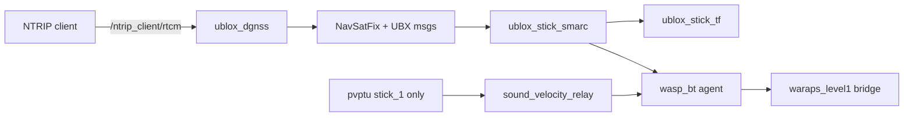

# Stick GPS / RTK / WARAPS stack (`smarc2_stick` branch)

This branch is the **all-in-one navigation stack for Stick surface vehicles**. It replaces the old split between `ublox_gps` (KumarRobotics), `smarc_gps_converters`, and `_vendor/ublox_dgnss`.

Use the **`ros2`** branch if you still need the legacy KumarRobotics `ublox_gps` driver.

---

## What you get

Plug in the X20P GPS, run one script, and the stack will:

1. Talk to the u-blox receiver over USB
2. Pull RTK corrections from SWEPOS over NTRIP
3. Publish SMARC topics (`latlon`, `speed`, `heading`)
4. Publish a TF tree for the antenna and acoustic modem
5. Start WARAPS Level-1 MQTT reporting (and PVPTU on `stick_1`)



---

## Packages (what each one does)

| Package | Plain English |
|---------|---------------|
| `ntrip_client_node` | Downloads RTCM correction data from the internet and publishes it on `/ntrip_client/rtcm` |
| `ublox_dgnss_node` | USB driver for the ZED-X20P; injects RTCM, configures the receiver |
| `ublox_nav_sat_fix_hp_node` | Turns high-precision UBX position into `sensor_msgs/NavSatFix` |
| `ublox_stick_smarc` | Publishes `smarc/latlon`, `smarc/speed`, `smarc/heading` |
| `ublox_stick_tf` | Publishes TF: `utm_* → utm → {robot}/odom → base_link → modem` |
| `ublox_stick_bringup` | Launch files, tmux script, RTK credentials template, WARAPS L1 config |
| `ublox_dgnss` | Metapackage + receiver TOML configs |
| `ublox_ubx_msgs` / `ublox_ubx_interfaces` | Low-level u-blox message definitions |

---

## Before you start

### Hardware

- u-blox **ZED-X20P** on USB (`1546:01ab`)
- Stick number **1** or **2** (decides NTRIP account and whether PVPTU starts)

### One-time setup

**1. USB permissions** (needs sudo, once per machine):

```bash
ros2 run ublox_stick_bringup install_ublox_udev.sh
# Unplug/replug the GPS USB cable afterwards
```

**2. RTK credentials** (once per machine):

```bash
cd src/stick/ublox
cp ublox_stick_bringup/config/rtk_credentials.env.example \
   ublox_stick_bringup/config/rtk_credentials.env
# Edit rtk_credentials.env — set NTRIP_USERNAME_1/2 and passwords
# (gitignored — create before the build in step 3)
```

**3. Build** (from your colcon workspace root):

```bash
git -C src/stick/ublox checkout smarc2_stick

colcon build --paths src/stick/ublox
source install/setup.bash
```

> If you previously built `_vendor/ublox_dgnss`, that path has a `COLCON_IGNORE` file so colcon does not build two copies of the same packages.

---

## Quick start (recommended)

### Full bringup — one command

```bash
source ~/colcon_ws/install/setup.bash

ros2 run ublox_stick_bringup stick_bringup.sh 1
```

Replace `1` with `2` for the second stick.

This opens a **tmux** session named `stick_1_bringup` (or `stick_2_bringup`).

| tmux window | What runs | stick_1 only? |
|-------------|-----------|---------------|
| `gps` | Full GPS stack (driver + SMARC + TF + NTRIP) | always |
| `waraps` | WARAPS vehicle agent | always |
| `mqtt` | MQTT bridge (Level-1 topics only) | always |
| `pvptu` | Sound velocity sensor driver | **stick_1** |
| `sound_vel` | Relays `sound_vel` → WARAPS | **stick_1** |
| `succorfish` | Placeholder | always |
| `serial_ping` | Placeholder | always |
| `spare` | Empty | always |

Detach from tmux: `Ctrl-b d`  
Reattach: `tmux attach -t stick_1_bringup`

To launch without attaching (e.g. from automation):

```bash
SKIP_ATTACH=1 ros2 run ublox_stick_bringup stick_bringup.sh 1
```

### GPS stack only (no WARAPS / MQTT)

```bash
ros2 launch ublox_stick_bringup stick_gps_stack.launch.py \
  robot_name:=stick_1 \
  frame_id:=stick_1_gps \
  username:=YOUR_NTRIP_USER \
  password:=YOUR_NTRIP_PASSWORD
```

Credentials can also come from `RTK_CREDENTIALS_FILE` if you want a non-default path.

---

## Is it working? (30-second checklist)

Run these in a **new terminal** (with workspace sourced):

```bash
# 1. Driver loaded?
ros2 node list | grep stick_1/ublox_dgnss

# 2. Sea config applied?
ros2 param get /stick_1/ublox_dgnss UBX_CONFIG_FILE
ros2 param get /stick_1/ublox_dgnss CFG_NAVSPG_DYNMODEL   # expect 5 (sea)

# 3. SMARC topics publishing?
ros2 topic hz /stick_1/smarc/latlon      # ~25 Hz
ros2 topic hz /stick_1/smarc/heading     # ~25 Hz when moving

# 4. Only one RTCM topic? (noise topics intentionally removed)
ros2 topic list | grep rtcm              # only /ntrip_client/rtcm

# 5. RTK corrections flowing?
ros2 topic hz /ntrip_client/rtcm         # ~1–3 Hz (bursty)

# 6. TF tree
ros2 run tf2_tools view_frames
# Expect: utm_* → utm → stick_1/odom → stick_1/base_link → stick_1/modem
```

### Frame meanings

| Frame | What it is |
|-------|------------|
| `utm_33_V` (auto) | Global UTM zone for your location |
| `utm` | Zone-neutral UTM parent |
| `stick_1/odom` | Local map origin — locked on first GPS fix |
| `stick_1/base_link` | **GPS antenna phase center** (position + yaw) |
| `stick_1/modem` | Acoustic modem, 1.57 m below antenna by default |

---

## Key topics

| Topic | Rate | Meaning |
|-------|------|---------|
| `/stick_1/ublox_gps_node/fix` | ~25 Hz | Standard GPS fix (backward-compatible name) |
| `/stick_1/smarc/latlon` | ~25 Hz | Lat / lon / alt for WARAPS and TF |
| `/stick_1/smarc/speed` | ~25 Hz | Ground speed (m/s) |
| `/stick_1/smarc/heading` | ~25 Hz | Ground-track heading (rad) |
| `/ntrip_client/rtcm` | ~1–3 Hz | RTCM corrections (injected into receiver) |

Topics **removed** on purpose (old stack had 3 RTCM topics; only NTRIP input is useful):

- `/{robot}/rtcm` — USB RTCM republish (disabled)
- `/{robot}/ubx_rxm_rtcm` — UBX RTCM status frames (disabled)

---

## Configuration

### Receiver config (sea rover)

File: `ublox_dgnss/config/x20p_stick_sea_rover.toml`

This is a **trimmed** X20P config for maritime RTK rover use. Launch always sets `UBX_CONFIG_FILE` to this file so the generic 131-parameter X20P TOML is never used by accident.

Important overrides applied in `stick_gps_stack.launch.py`:

| Setting | Value | Why |
|---------|-------|-----|
| `CFG_NAVSPG_DYNMODEL` | 5 | Sea dynamics model |
| `CFG_MSGOUT_UBX_NAV_VELNED_USB` | 1 | Heading + speed (required for SMARC) |
| `CFG_MSGOUT_UBX_RXM_RTCM_USB` | 0 | No RTCM status spam |
| `RTCM_REPUBLISH_ENABLED` | false | No `/{robot}/rtcm` topic |
| `UBX_RXM_RTCM_ENABLED` | false | No `/{robot}/ubx_rxm_rtcm` topic |

### Modem offset

Default Z offset antenna → modem: **-1.57 m**. Override at launch:

```bash
ros2 launch ublox_stick_bringup stick_gps_stack.launch.py modem_z_offset:=-1.57 ...
```

### WARAPS MQTT (Level 1 only)

Config: `ublox_stick_bringup/config/waraps_level1.yaml`

Publishes sensor heartbeat/position/heading/speed/etc. **No** exec/tst/bt topics.

Upstream copies for smarc2 PR: `config/smarc2_upstream/`

---

## Troubleshooting

| Symptom | Likely cause | Fix |
|---------|--------------|-----|
| `ros2 topic echo /stick_1/rtcm` fails | Topic removed by design | Echo `/ntrip_client/rtcm` instead |
| `/ntrip_client/rtcm` has no data | `ublox_dgnss` not running or NTRIP reconnecting | Check gps tmux window for errors; verify `ros2 node list \| grep ublox_dgnss` |
| No `smarc/heading` | VELNED not enabled or not moving | Confirm `CFG_MSGOUT_UBX_NAV_VELNED_USB` is 1; drive the stick slowly |
| `ublox_dgnss` failed to load | Stale build | `colcon build --packages-select ublox_dgnss_node --allow-overriding ublox_dgnss_node` then restart gps window |
| USB permission denied | udev rule missing | Run `install_ublox_udev.sh`, replug USB |
| NTRIP keeps reconnecting | Bad credentials or no GPS fix for GGA | Check `ublox_stick_bringup/config/rtk_credentials.env`; wait for fix on `/stick_1/ublox_gps_node/fix` |
| MQTT bridge died | Broker unreachable | Check network to `20.240.40.232:1884`; GPS stack still works without MQTT |

---

## Migrating from the old stack

| Old location | New location |
|--------------|--------------|
| `smarc_gps_converters/scripts/stick_bringup.sh` | `ublox_stick_bringup/scripts/stick_bringup.sh` |
| `smarc_gps_converters` SMARC converter | `ublox_stick_smarc` |
| `smarc_gps_converters` TF publisher | `ublox_stick_tf` |
| `_vendor/ublox_dgnss` | This repo (`smarc2_stick` branch) |
| `ublox_gps` (KumarRobotics) | `ublox_dgnss_node` (aussierobots) |

---

## Branch guide

| Branch | Use when |
|--------|----------|
| **`smarc2_stick`** | Stick surface vehicles — GPS + RTK + SMARC + TF + WARAPS |
| **`ros2`** | Legacy KumarRobotics `ublox_gps` driver |

---

## License

Apache 2.0 for `ublox_dgnss` stack components (aussierobots). Stick bringup packages: BSD-3-Clause.
