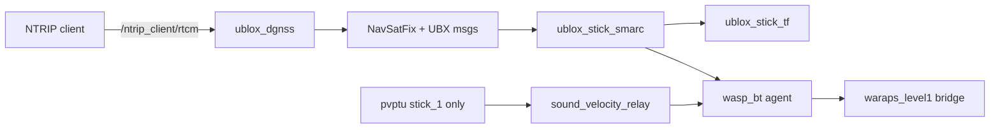

# Stick GPS / RTK / WARAPS stack (`smarc2_stick` branch)

This branch is the **all-in-one navigation stack for Stick surface vehicles**. It replaces the older multi-package setup (`ublox_gps`, separate SMARC/TF converters, and an external `ublox_dgnss` tree).

Use the **`ros2`** branch if you still need the legacy KumarRobotics `ublox_gps` driver.

---

## What you get

Plug in the Stick (Teensy + X20P over `/dev/ttyACM1`), run one script, and the stack will:

1. Talk to the u-blox receiver over **UART1** via the Teensy byte-transparent bridge (`serial_ubx`)
2. Pull RTK corrections from SWEPOS over NTRIP
3. Publish SMARC topics (`latlon`, `speed`, `heading`) with **receiver GPS timestamps**
4. Publish a TF tree for the antenna and acoustic modem
5. Start WARAPS Level-1 MQTT reporting (and PVPTU on `stick_1`)

For a bench setup with the X20P on **direct USB** (no Teensy), set `GPS_BACKEND=usb` (see [GPS backends](#gps-backends)).



---

## Packages (what each one does)

| Package | Plain English |
|---------|---------------|
| `ntrip_client_node` | Downloads RTCM correction data from the internet and publishes it on `/ntrip_client/rtcm` |
| `ublox_dgnss_node` | Driver for the ZED-X20P (USB or serial); injects RTCM, configures the receiver |
| `ublox_nav_sat_fix_hp_node` | Turns high-precision UBX position into `sensor_msgs/NavSatFix` |
| `ublox_stick_smarc` | Publishes `smarc/latlon`, `smarc/speed`, `smarc/heading` |
| `ublox_stick_tf` | Publishes TF: `utm_* → utm → {robot}/odom → base_link → modem_link` |
| `ublox_stick_bringup` | Launch files, tmux script, RTK credentials template, WARAPS L1 config |
| `ublox_dgnss` | Metapackage + receiver TOML configs |
| `ublox_ubx_msgs` / `ublox_ubx_interfaces` | Low-level u-blox message definitions |

---

## Before you start

### Hardware

**Stick fleet (default):** u-blox **ZED-X20P** UART routed through a **Teensy 4.1** GNSS bridge:
- Teensy `SerialUSB1` → `/dev/ttyACM1` @ **38400 baud** (UBX + RTCM + interleaved NMEA)
- Teensy `Serial` (LoLo) → `/dev/ttyACM0` (not used by this GPS stack)

**Bench / dev (optional):** X20P on direct USB (`1546:01ab`) — use `GPS_BACKEND=usb`.

Stick number **1** or **2** (decides NTRIP account and whether PVPTU starts).

### One-time setup

**1. Serial permissions** (Stick default — Teensy on `/dev/ttyACM1`):

```bash
sudo usermod -aG dialout $USER
# Log out and back in, then verify:
groups | grep dialout
ls -la /dev/ttyACM1
```

**2. USB permissions** (only if using `GPS_BACKEND=usb` — direct X20P on USB):

```bash
ros2 run ublox_stick_bringup install_ublox_udev.sh
# Unplug/replug the GPS USB cable afterwards
```

**3. Teensy firmware** (Stick hardware): flash the **OWTT_Modem_LOLO ver3** sketch (byte-transparent UBX passthrough on `SerialUSB1` ↔ X20P UART1 @ **38400 baud**). Without this firmware, `serial_ubx` will not work.

**4. RTK credentials** (once per machine):

```bash
# From the root of this repo (wherever you cloned it)
cp ublox_stick_bringup/config/rtk_credentials.env.example \
   ublox_stick_bringup/config/rtk_credentials.env
# Edit rtk_credentials.env — set NTRIP_USERNAME_1/2 and passwords
# (gitignored — create before the build in step 3)
```

**5. Build** (from your colcon workspace `src/` directory):

```bash
# Clone into workspace src/ (path is up to you)
git clone -b smarc2_stick https://github.com/NinjaTuna007/ublox.git

# Build from workspace root
cd ~/your_colcon_ws
colcon build --paths src/ublox
source install/setup.bash

# Sanity check — these must succeed before launch
python3 -c "import ublox_stick_smarc, ublox_stick_tf"

# Confirm Teensy GNSS port (Stick default)
ls -la /dev/ttyACM1
```

Your user must be in the `dialout` group to open `/dev/ttyACM1`. The Teensy sketch must pass **binary UBX** through `SerialUSB1` ↔ X20P UART1 (not NMEA-only unless using `nmea_serial` fallback).

### Friend clone checklist

If you are setting up a **second machine** with the same Stick hardware:

1. Clone branch **`smarc2_stick`** (not `ros2` or `main`)
2. Copy and fill `rtk_credentials.env` **before** build
3. `colcon build --paths src/ublox` then `source install/setup.bash`
4. Confirm `python3 -c "import ublox_stick_smarc, ublox_stick_tf"` — if this fails, ensure `__init__.py` files exist under both packages (fixed in current branch)
5. Plug in Stick, confirm `/dev/ttyACM1` exists
6. Run `ros2 run ublox_stick_bringup stick_bringup.sh 1` — **no env vars required** on standard Stick wiring
7. In the `gps` tmux window, look for `Serial transport enabled on /dev/ttyACM1 @ 38400 baud` and `GPS receiver time anchor locked`

---

## Quick start (recommended)

### Full bringup — one command

```bash
source ~/your_colcon_ws/install/setup.bash

ros2 run ublox_stick_bringup stick_bringup.sh 1
```

Replace `1` with `2` for the second stick.

**Default backend is `serial_ubx`** (Teensy on `/dev/ttyACM1`). No extra env vars needed on Stick hardware. For direct X20P USB instead:

```bash
GPS_BACKEND=usb ros2 run ublox_stick_bringup stick_bringup.sh 1
```

This opens a **tmux** session named `stick_1_bringup` (or `stick_2_bringup`).

| tmux window | What runs | stick_1 only? |
|-------------|-----------|---------------|
| `gps` | Full GPS stack (driver + SMARC + TF + NTRIP) | always |
| `foxglove` | Foxglove WebSocket bridge (`ws://localhost:8765`) | always |
| `waraps` | WARAPS vehicle agent | always |
| `mqtt` | MQTT bridge (Level-1 topics only) | always |
| `pvptu` | Sound velocity sensor driver | **stick_1** |
| `sound_vel` | Relays `sound_vel` → WARAPS | **stick_1** |
| `succorfish` | Placeholder | always |
| `serial_ping` | Placeholder | always |
| `spare` | Empty | always |

Detach from tmux: `Ctrl-b d`  
Reattach: `tmux attach -t stick_1_bringup`

To launch without attaching (e.g. from automation):

```bash
SKIP_ATTACH=1 ros2 run ublox_stick_bringup stick_bringup.sh 1
```

### GPS stack only (no WARAPS / MQTT)

```bash
# Direct X20P USB (RTK)
ros2 launch ublox_stick_bringup stick_gps_stack.launch.py \
  robot_name:=stick_1 \
  username:=YOUR_NTRIP_USER \
  password:=YOUR_NTRIP_PASSWORD

# Teensy / virtual serial — full UBX + RTK on /dev/ttyACM1 (recommended)
ros2 launch ublox_stick_bringup stick_gps_stack.launch.py \
  robot_name:=stick_1 \
  gps_backend:=serial_ubx \
  serial_port:=/dev/ttyACM1 \
  serial_baud:=38400 \
  username:=YOUR_NTRIP_USER \
  password:=YOUR_NTRIP_PASSWORD

# Teensy / virtual serial — NMEA-only fallback (no RTK)
ros2 launch ublox_stick_bringup stick_gps_stack.launch.py \
  robot_name:=stick_1 \
  gps_backend:=nmea_serial \
  serial_port:=/dev/ttyACM1 \
  enable_ntrip:=false
```

`frame_id` defaults to `{robot_name}/base_link` so NavSatFix aligns with the TF antenna frame (required for Foxglove map overlay).

Credentials can also come from `RTK_CREDENTIALS_FILE` if you want a non-default path.

### Teensy hardware (current Stick wiring)

When the X20P UART is routed through a **Teensy 4.1** byte-transparent bridge on `SerialUSB1` (`/dev/ttyACM1`), the **default bringup already uses this** (`GPS_BACKEND=serial_ubx`).

```bash
source ~/your_colcon_ws/install/setup.bash

# Default Stick bringup (serial_ubx + NTRIP)
ros2 run ublox_stick_bringup stick_bringup.sh 1

# Explicit overrides (usually unnecessary)
GPS_BACKEND=serial_ubx SERIAL_PORT=/dev/ttyACM1 SERIAL_BAUD=38400 \
  ros2 run ublox_stick_bringup stick_bringup.sh 1

# NMEA-only fallback (no RTCM injection)
GPS_BACKEND=nmea_serial SERIAL_PORT=/dev/ttyACM1 ENABLE_NTRIP=false \
  ros2 run ublox_stick_bringup stick_bringup.sh 1
```

`serial_ubx` uses the same `ublox_dgnss_node` pipeline as direct USB, but over `/dev/ttyACM1` at **38400 baud** (matching the Teensy sketch). Receiver timestamps come from **UBX-NAV-TIMEUTC + iTOW**, not host arrival time. `nmea_serial` parses `$GNGGA` / `$GNRMC` / `$GNVTG` only — no receiver config or RTCM.

### GPS backends

| Backend | When to use | Transport |
|---------|-------------|-----------|
| `serial_ubx` | **Stick default** — Teensy GNSS bridge | `/dev/ttyACM1` @ 38400 |
| `usb` | Bench — X20P plugged in directly | libusb `1546:01ab` |
| `nmea_serial` | Lightweight fallback, no RTK | `/dev/ttyACM1` NMEA parse only |

| Capability | `gps_backend:=usb` | `gps_backend:=serial_ubx` | `gps_backend:=nmea_serial` |
|------------|-------------------|---------------------------|---------------------------|
| Position / heading / speed | Yes (UBX) | Yes (UBX) | Yes (NMEA) |
| SMARC + TF + WARAPS | Yes | Yes | Yes |
| RTK / NTRIP corrections | Yes | Yes | No (disable `enable_ntrip`) |
| Receiver configuration | Yes (TOML) | Yes (UART1 overrides) | No (pre-configured on board) |

---

## Is it working? (30-second checklist)

Run these in a **new terminal** (with workspace sourced):

```bash
# 1. Driver loaded?
ros2 node list | grep stick_1/ublox_dgnss

# 2. Serial transport OK? (gps tmux window)
#    Expect: "Serial transport enabled on /dev/ttyACM1 @ 38400 baud"
#    Expect: "GPS receiver time anchor locked (iTOW=...)"

# 3. Sea config applied?
ros2 param get /stick_1/ublox_dgnss UBX_CONFIG_FILE
ros2 param get /stick_1/ublox_dgnss CFG_NAVSPG_DYNMODEL   # expect 5 (sea)

# 4. SMARC topics publishing?
ros2 topic hz /stick_1/smarc/latlon      # ~25 Hz
ros2 topic hz /stick_1/smarc/heading     # ~25–100 Hz when moving

# 5. Only one RTCM topic? (noise topics intentionally removed)
ros2 topic list | grep rtcm              # only /ntrip_client/rtcm

# 6. RTK corrections flowing?
ros2 topic hz /ntrip_client/rtcm         # ~1–3 Hz (bursty)

# 7. TF tree connected?
ros2 run tf2_tools view_frames
# Expect: utm_* → utm → stick_1/odom → stick_1/base_link → stick_1/modem_link
```

### Frame meanings

| Frame | What it is |
|-------|------------|
| `utm_33_V` (auto) | Global UTM zone for your location |
| `utm` | Zone-neutral UTM parent |
| `stick_1/odom` | Local map origin — locked on first GPS fix (XY from UTM, Z at ellipsoid height datum) |
| `stick_1/base_link` | **GPS antenna phase center** (position + yaw); Z in odom is relative to first-fix altitude |
| `stick_1/modem_link` | Acoustic modem, 1.57 m below antenna by default |

---

## Key topics

| Topic | Rate | Meaning |
|-------|------|---------|
| `/stick_1/ublox_gps_node/fix` | ~25 Hz | Standard GPS fix (backward-compatible name) |
| `/stick_1/smarc/latlon` | ~25 Hz | Lat / lon / alt for WARAPS and TF |
| `/stick_1/smarc/speed` | ~25 Hz | Ground speed (m/s) |
| `/stick_1/smarc/heading` | ~25 Hz | Ground-track heading (rad) |
| `/ntrip_client/rtcm` | ~1–3 Hz | RTCM corrections (injected into receiver) |

Topics **removed** on purpose (old stack had 3 RTCM topics; only NTRIP input is useful):

- `/{robot}/rtcm` — USB RTCM republish (disabled)
- `/{robot}/ubx_rxm_rtcm` — UBX RTCM status frames (disabled)

---

## Configuration

### Receiver config (sea rover)

File: `ublox_dgnss/config/x20p_stick_sea_rover.toml`

This is a **trimmed** X20P config for maritime RTK rover use. Launch always sets `UBX_CONFIG_FILE` to this file so the generic 131-parameter X20P TOML is never used by accident.

Important overrides applied in `stick_gps_stack.launch.py`:

| Setting | `usb` | `serial_ubx` (Stick default) |
|---------|-------|------------------------------|
| Transport | libusb | `DEVICE_TRANSPORT=serial`, `/dev/ttyACM1` @ 38400 |
| `CFG_NAVSPG_DYNMODEL` | 5 | 5 (sea) |
| Position output | `CFG_MSGOUT_UBX_NAV_HPPOSLLH_USB` | `CFG_MSGOUT_UBX_NAV_HPPOSLLH_UART1` |
| Heading/speed | `CFG_MSGOUT_UBX_NAV_VELNED_USB` | `CFG_MSGOUT_UBX_NAV_VELNED_UART1` |
| GPS time | — | `CFG_MSGOUT_UBX_NAV_TIMEUTC_UART1` (receiver timestamps) |
| RTCM input | `CFG_USBINPROT_RTCM3X` | `CFG_UART1INPROT_RTCM3X` |
| `CFG_MSGOUT_UBX_RXM_RTCM_USB` | 0 | N/A |
| `RTCM_REPUBLISH_ENABLED` | false | false |

### USB device selection (`gps_backend:=usb` only)

When using **direct USB** (bench setup), `ublox_dgnss_node` talks to the receiver over **libusb**, not `/dev/ttyACM*`. It auto-detects u-blox devices by USB vendor/product ID (`1546:01ab` for the X20P main interface).

If you have **multiple** u-blox devices plugged in, set the USB serial string:

```bash
# Launch arg
ros2 launch ublox_stick_bringup stick_gps_stack.launch.py device_serial_string:=YOUR_ISERIAL ...

# Bringup env var
DEVICE_SERIAL_STRING=YOUR_ISERIAL ros2 run ublox_stick_bringup stick_bringup.sh 1
```

Find candidates with `lsusb -d 1546:` or read the iSerial in `dmesg` after plug-in.

Leave empty (default) to use the first matching X20P USB interface.

> **Stick default (`serial_ubx`):** Opens `/dev/ttyACM1` @ 38400 through the Teensy GNSS bridge — see [Teensy hardware](#teensy-hardware-current-stick-wiring). For bench direct USB, set `GPS_BACKEND=usb`. Use `nmea_serial` only as a no-RTK fallback.

### udev rules

`install_ublox_udev.sh` matches **any** board with u-blox USB IDs — not a specific X20P serial number:

| Product ID | Device |
|------------|--------|
| `1546:01ab` | ZED-X20P main USB interface (what this stack uses) |
| `1546:01a9` | ZED-F9P/F9R (also permitted) |

Rules grant `MODE=0666` to the raw USB device node. They do **not** apply to Teensy virtual COM ports (`/dev/ttyACM*`), which use different USB IDs and permissions.

### Modem offset

Default Z offset antenna → modem: **-1.57 m**. Override at launch:

```bash
ros2 launch ublox_stick_bringup stick_gps_stack.launch.py modem_z_offset:=-1.57 ...
```

### WARAPS MQTT (Level 1 only)

Config: `ublox_stick_bringup/config/waraps_level1.yaml`

Publishes sensor heartbeat/position/heading/speed/etc. **No** exec/tst/bt topics.

Upstream copies for smarc2 PR: `config/smarc2_upstream/`

---

## Troubleshooting

| Symptom | Likely cause | Fix |
|---------|--------------|-----|
| `ModuleNotFoundError: ublox_stick_smarc` / `ublox_stick_tf` | Missing `__init__.py` in clone (old `.gitignore`), workspace not sourced, or stale build | Pull latest `smarc2_stick`; ensure `ublox_stick_smarc/ublox_stick_smarc/__init__.py` and `ublox_stick_tf/ublox_stick_tf/__init__.py` exist; `source install/setup.bash`; `colcon build --paths src/ublox`; verify imports |
| `malformed launch argument 'device_serial_string:='` | Empty `DEVICE_SERIAL_STRING` passed to launch | Fixed in latest `stick_bringup.sh` — pull and rebuild `ublox_stick_bringup` |
| `ros2 topic echo /stick_1/rtcm` fails | Topic removed by design | Echo `/ntrip_client/rtcm` instead |
| `/ntrip_client/rtcm` has no data | `ublox_dgnss` not running or NTRIP reconnecting | Check gps tmux window for errors; verify `ros2 node list \| grep ublox_dgnss` |
| No `smarc/heading` / broken TF tree | VELNED not on UART1, or heading not flowing | On `serial_ubx`, confirm `CFG_MSGOUT_UBX_NAV_VELNED_UART1`; check `/stick_1/smarc/heading` and TF in `view_frames` |
| `ublox_dgnss` segfault / dies on start | Stale build or old serial transport | `colcon build --packages-select ublox_dgnss_node --allow-overriding ublox_dgnss_node`; restart gps tmux window |
| `ublox_dgnss` failed to load | Stale build | `colcon build --packages-select ublox_dgnss_node --allow-overriding ublox_dgnss_node` then restart gps window |
| Permission denied on `/dev/ttyACM1` | User not in `dialout` | `sudo usermod -aG dialout $USER` then re-login; or check port permissions |
| Wrong serial port | Teensy exposes two ACM devices | GNSS bridge is **`/dev/ttyACM1`** (`SerialUSB1`); `ttyACM0` is LoLo |
| Driver can't find GPS with `GPS_BACKEND=usb` | X20P not on direct USB | Use default `serial_ubx` for Teensy; or plug X20P in directly and set `GPS_BACKEND=usb` |
| USB permission denied (`usb` backend) | udev rule missing | Run `install_ublox_udev.sh`, replug USB |
| NTRIP keeps reconnecting | Bad credentials or no GPS fix for GGA | Check `ublox_stick_bringup/config/rtk_credentials.env`; wait for fix on `/stick_1/ublox_gps_node/fix` |
| MQTT bridge died | Broker unreachable | Check network to `20.240.40.232:1884`; GPS stack still works without MQTT |

---

## Migrating from the old stack

| Old location | New location |
|--------------|--------------|
| `smarc_gps_converters/scripts/stick_bringup.sh` | `ublox_stick_bringup/scripts/stick_bringup.sh` |
| `smarc_gps_converters` SMARC converter | `ublox_stick_smarc` |
| `smarc_gps_converters` TF publisher | `ublox_stick_tf` |
| `ublox_gps` (KumarRobotics) | `ublox_dgnss_node` (aussierobots) |

---

## Branch guide

| Branch | Use when |
|--------|----------|
| **`smarc2_stick`** | Stick surface vehicles — GPS + RTK + SMARC + TF + WARAPS |
| **`ros2`** | Legacy KumarRobotics `ublox_gps` driver |

---

## License

Apache 2.0 for `ublox_dgnss` stack components (aussierobots). Stick bringup packages: BSD-3-Clause.
